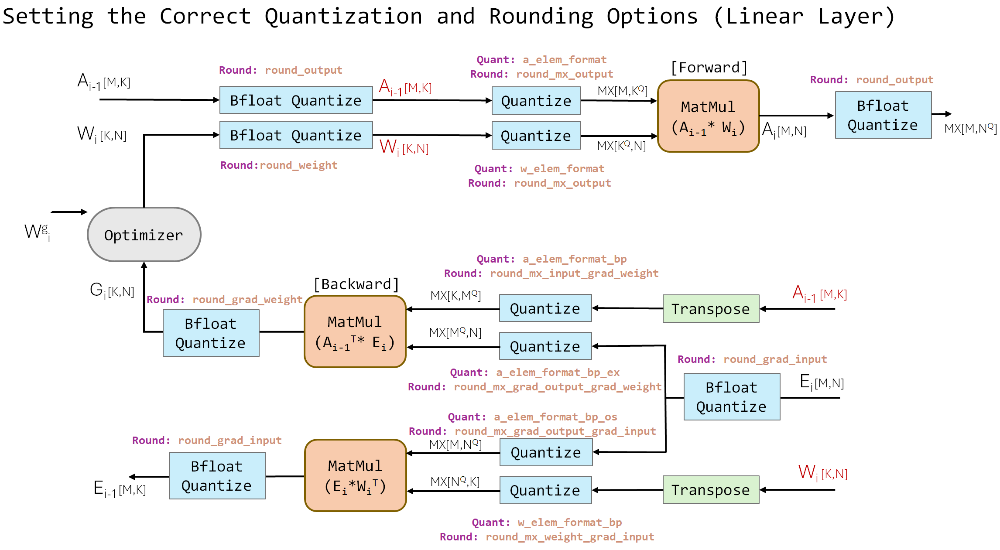
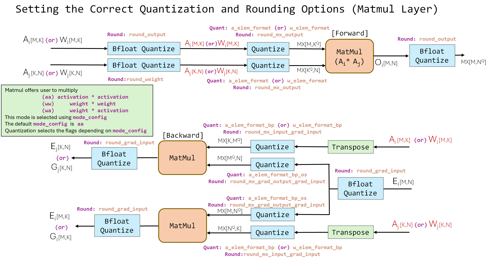
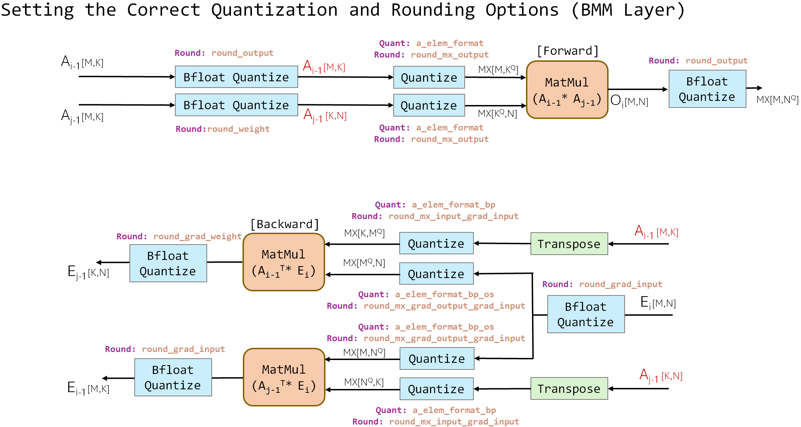

# MX Pytorch Emulation Library #

[OCP MX Formats Specification](https://www.opencompute.org/documents/ocp-microscaling-formats-mx-v1-0-spec-final-pdf)

This library provides the capability to emulate MX-compatble formats
and bfloat quantization in pytorch, enabling data science exploration
for DNNs with different MX formats.
The underlying computations are done in float32/bfloat16/fp16 but with values restricted to
the representable range of MX-compatible or bfloat data formats.

At high level, the following operations are supported:
 * Matrix multiplication (torch.matmul, torch.linear, torch.bmm) between two
   MX tensors
 * Elementwise ops (GELU, softmax, layernorm) where all basic operations (add,
   sub, sqrt, exp, etc) are performed in bfloat precision.

The specific data formats (i.e., FP8\_e4m3, bfloat16) can be configured
using an **mx\_specs** dictionary which is an input to nearly every function.
See [Spec Configuration](#Spec-Configuration).

For simulational speed and accuracy, we provide custom CUDA extensions for
basic MX/bfloat quantization. The custom CUDA code is faster, and in the case of
MX more numerically accurate than pytorch GPU. See [Pytorch CUDA Bugs](#Pytorch-CUDA-Bugs).

## Requirements ##
We recommend using [Nvidia-PyTorch Container](https://catalog.ngc.nvidia.com/orgs/nvidia/containers/pytorch)

CUDA is required (11.3+ recommended).
For Python packages see ```requirements.txt```.

## Trademark Notice ##
**Trademarks** This project may contain trademarks or logos for projects, products,
or services. Authorized use of Microsoft trademarks or logos is subject to and
must follow [Microsoft’s Trademark & Brand Guidelines](https://www.microsoft.com/en-us/legal/intellectualproperty/trademarks/usage/general).
Use of Microsoft trademarks or logos in modified versions of this project must not cause
confusion or imply Microsoft sponsorship. Any use of third-party trademarks or
logos are subject to those third-party’s policies.

## Integration Guide ##
There are two ways to integrate the library into your PyTorch models.
1. Manually replace each PyTorch module (```torch.nn.*```) and PyTorch function (```torch.nn.function.*```)
   with its equivalent mx library module/function in the model code.
   This is time-consuming and error-prone, but gives users more precise control over quantization.
2. Use ```mx_mapping.inject_pyt_ops``` to replace PyTorch modules/functions in
   the global python scope, then build your model.
3. See [MX Option Parsing](#MX-Option-Parsing) to setup argument parsing.

The repo contains a PDF guide for manual integration.
The ```examples``` folders also contains working code samples.
 * ```examples/ffn.py```: base model
 * ```examples/ffn_mx_manual.py```: manual integration
 * ```examples/ffn_mx_auto.py```: auto-inject integration

## Files ##
#### Configuration ####
 * ```specs.py```: configurable settings for MX and bfloat quantization, functions
   to help parse these settings with ArgParse.

#### Basic Operators ####
 * ```mx_ops.py```: functions to convert Pytorch Tensors to an MX-compatible data format
 * ```elemwise_ops.py```: functions to convert Pytorch Tensors to a bfloat (or fp) data format
 * ```vector_ops.py```: vector ops (e.g., +, -, exp, sqrt) at bfloat (or fp) precision

#### Linear Functions and Layers ####
 * ```linear.py```: MX drop-in replacements for Pytorch Linear/linear
 * ```matmul.py```: MX drop-in replacement for Pytorch matmul
 * ```bmm.py```: MX drop-in replacement for torch bmm

#### Elementwise Functions and Layers ####
 * ```activations.py```: bfloat drop-in replacements for Pytorch relu, gelu, sigmoid
 * ```layernorm.py```: bfloat drop-in replacements for Pytorch LayerNorm, RMSNorm
 * ```softmax.py```: bfloat drop-in replacements for Pytorch Softmax/softmax

#### Custom CUDA Extension ####
 * ```custom_extensions.py```: Pytorch extension, interfaces with the C++/CUDA code
 * ```cpp/funcs.cpp```: defines which C++/CUDA functions are exposed to pytorch
 * ```cpp/common.cuh```: functions to quantize a single float value to MX or bfloat/fp
 * ```cpp/quantize.cu```: functions to quantize a Pytorch tensor to MX or bfloat/fp
 * ```cpp/reduce.cu```: functions to compute a sum/max reduction over one axis of a Pytorch tensor

## Spec Configuration ##
Operators, functions, and layers provided by this library all take ```mx_specs```
dictionary as an argument. The available configuration options are found in ```specs.py```.

### MX Options ###
The first set of options configure the MX-compatible data format.
They only apply to the linear layers (linear, matmul, bmm).
Please see [W and A bits](#W-and-a-bits).
 * ```scale_bits```: Number of bits for the MX shared scale.
 * ```w_elem_format```: String name of the MX element format for weights.
  A value of None means no quantization is performed.
 * ```a_elem_format```: MX element format for activations.
 * ```w_elem_format_bp```: MX element format for weights in the backward pass.
 * ```a_elem_format_bp_ex```: MX element format for activations in the backward
  pass for computing the weight update.
 * ```a_elem_format_bp_os```: MX element format for activations in the backward
  pass for computing the error gradient.
 * ```block_size```: MX scaling block size. Default is 0.
  A value of 0 means the entire dim shares a single exponent.
  For MX-compatible formats this should be 32.
 * ```shared_exp_method```: Method to compute the MX shared exponent.
  For MX-compatible formats this should be "max". Default "max".

In the linear layers (linear, matmul, bmm), linear assumes its two inputs
are activaitons and weight. However, matmul and bmm assume both inputs
are activations. Please see [W and A](#W-and-a).





The next set of options configure bfloat and fp data format. They apply to
non-matrix operations like add, mul, sqrt, and exp. Layers such as
layernorm, softmax, and GELU are computed using these operations.
Only one of ```bfloat``` or ```fp``` should take a non-zero value.
If both ```bfloat``` and ```fp``` are set to 0, non-matrix operations
will be computed in native FP32 format.
 * ```bfloat```: BfloatX format. A value of 0 means no bfloat quantization.
  For bfloat16 this should be set to 16.
  Default 0.
 * ```fp```: fpX format with a fixed exponent width of 5.
  A value of 0 means no fp quantization.
  For fp16 this should be set to 16. Default 0.
 * ```bfloat_subnorms```: Allow bfloat quantization to represent subnorms.
  Default True. False means subnorms are flushed to zero.

The next set of options configure whether quantization is applied to certain layers.
 * ```quantize_backprop```: Apply MX and bfloat quantization on the
  backward pass computations. 
  If False, no quantization is applied even if options like
  *w\_elem\_format\_bp* are set. Default True.

The final set of options configure miscellaneous settings in the library.
 * ```round```: Global rounding behavior for MX and bfloat quantization.
  Options are 'nearest', 'floor', and 'even'. Default 'nearest'.
 * ```softmax_exp2```: Softmax is computed using 2^x instead of e^x. Default False.
 * ```custom_cuda```: Use custom CUDA code instead of Pytorch. Default False.

### Spec Concrete MX-Compatible Formats ###
The examples below show how to create the mx_specs dictionary and configure it for
each concrete MX-compatible format. For simplicity we ignore the backward pass
specs like w\_elem\_format\_bp.
```
# MXFP8_e5m2 matmuls with bfloat16 vector ops, forward pass only
mx_specs = MxSpecs()

mx_specs[‘scale_bits’] = 8
mx_specs[‘w_elem_format’] = 'fp8_e5m2'
mx_specs[‘a_elem_format’] = 'fp8_e5m2'
mx_specs[‘block_size’] = 32
mx_specs[‘bfloat’] = 16
mx_specs[‘custom_cuda’] = True
```
```
# MXFP4_e2m1 matmuls with bfloat16 vector ops, forward pass only
mx_specs = MxSpecs()

mx_specs[‘scale_bits’] = 8
mx_specs[‘w_elem_format’] = 'fp4_e2m1'
mx_specs[‘a_elem_format’] = 'fp4_e2m1'
mx_specs[‘block_size’] = 32
mx_specs[‘bfloat’] = 16
mx_specs[‘custom_cuda’] = True
```
```
# MXINT8 matmuls with bfloat16 vector ops, forward pass only
mx_specs = MxSpecs()

mx_specs[‘scale_bits’] = 8
mx_specs[‘w_elem_format’] = 'int8'
mx_specs[‘a_elem_format’] = 'int8'
mx_specs[‘block_size’] = 32
mx_specs[‘bfloat’] = 16
mx_specs[‘custom_cuda’] = True
```

### Backward Pass Quantization ###
For MX quantization of the matmuls on the backward pass, the setting
```quantize_backprop``` must be True.

### W and A ###
The ```Linear``` layer and the ```linear``` function  uses ```a_elem_format```
for the first input and ```w_elem_format``` for the second input.
The ```matmul``` and ```bmm``` functions have a bits\_config argument which
selects the operation mode (weight x act, act x weight, or act x act)

The library currently assumes that:
 * ```linear``` is used for activation x weight matmuls
 * ```matmul``` or ```bmm``` is used for activation x activations matmuls

### MX Option Parsing ###
The function ```add_mx_args``` in ```specs.py``` will add an argument for each spec option
to an ```argparse.ArgumentParser``` object. Note that the defaults of the args
added this way will be None. Pass the output of ```parser.parse_args()``` to
the function ```get_mx_specs``` to obtain the correct spec dictionary. Example:
```
# Example on how to setup and parse MX config flags
parser = argparse.ArgumentParser()
parser = add_mx_args(parser)
args = parser.parse_args()
mx_specs = get_mx_specs(args)
```

If not set explicitly in the arguments, the backward pass MX formats
(```w_elem_format_bp```, ```a_elem_format_bp```, ```a_elem_format_bp_ex```, ```a_elem_format_bp_os```)
will be assigned the values of ```w_elem_format``` and ```a_elem_format```.

Boolean flags that are by default **True** will be added to ArgumentParser
with a "--no-" prefix and default **False**. E.g., the flag ```--quantize-backprop```
is default True. It will appear in the parser as ```--no-quantize-backprop```
which is default False.

## Testing ##
There is a unit test suite provided with this library under the
```mx/tests``` folder. You can run all tests from that folder with
```python -m pytest .```. The pytest pip package is required.

The unit tests have been tested to pass on these configurations:
 * pytorch-2.4.0 + cuda12.5 + Nvidia V100
 * pytorch-2.4.0 + cuda12.5 + Nvidia A100
 * pytorch-2.4.0 + cuda12.5 + Nvidia H100

## Numerics ##
### Pytorch CUDA Inaccuracies ###
The golden reference for numeric results is *pytorch CPU*.
On the GPU, the custom CUDA code is more numerically robust than
the (algorithmically equivalent) pytorch code.
An example inaccuracy for pytorch code running on Nvidia V100 with Pytorch 1.9.1 + CUDA 11.3:
```
>>> # We want to shift x to the left by 16 bits
>>> x = torch.tensor([1.], dtype=torch.float32, device='cuda')
>>> e = torch.tensor([16.], dtype=torch.float32, device='cuda')
>>> x * (2**e)
tensor([65535.9961], device='cuda:0')  # should be 65536
```
In fact, we disabled unit testing for pytorch GPU (for MX only)
because this and rounding bugs (0.5 gets rounded down) kept
causing mismatches against pytorch CPU.

### NaNs/Infs ###
**MX**: NaNs are preserved, Infs are either preserved or converted to NaNs.
        Other values in a vector containing one or more NaNs/Infs have
        undefined quantization behavior.
**Bfloat**: NaNs/Infs are fully preserved.

### Denorms ###
**MX**: denorms are supported by default.
**Bfloat**: denorms are supported by default and can be flushed to zero by
setting ```bfloat_subnorms``` to False.

### Rounding ###
In our code, **MX** and **Bfloat** support three rounding modes:
 * 'even': Round half to nearest even. 1.5 rounds to 2. 2.5 rounds to 2.
 * 'nearest': Round half away from zero. -1.5 rounds to -2.
 * 'floor': Round toward zero. -1.9 rounds to -1. 

Rounding interacts with the shared exponent in the following way.
Example: Consider a hypothetical MXINT3 (1 sign bit, 2 mantissa bits).
Let the shared exponent be 2. The quantization grid points are:  
[-1.5, -1.0, -0.5,  0.0, +0.5, +1.0, +1.5]
With this system, any number in [1.5, 2) are rounded to 1.5. There can't be a 2 or the shared exp would become 2.
Even 1.99 gets rounded to 1.5

### MXINT 2's Complement ###
Following the OCP MX Formats Specification, MXINT elements utilize 2's complement
with the asymmetric maximum negative representation left unused.
The representable values in this encoding are identical to those of sign-magnitude.

## CUDA Extensions ##
The ```cpp``` directory includes custom C++ and CUDA implementations of
MX library functions. These are automatically JIT-compiled via
custom\_extensions.py

The following are some references for creating custom extensions for PyTorch:
* Custom C++ and CUDA Extension: https://pytorch.org/tutorials/advanced/cpp\_extension.html
* Tensor class: https://pytorch.org/cppdocs/api/classat\_1\_1\_tensor.html
* Tensor creation API: https://pytorch.org/cppdocs/notes/tensor\_creation.html

In the CUDA files, we subsitute the following MX terminology
as "block_size" already has a different meaning in CUDA:
 * "block_size" -> "tile_size"

The CUDA code was compiled and tested on a machine with the following:
| Information       | Nvidia V100                | Nvidia A100                | Nvidia H100                |
|-------------------|:--------------------------:|:--------------------------:|:--------------------------:|
| Container Image   | nvcr.io/nvidia/pytorch:24.06-py3 | nvcr.io/nvidia/pytorch:24.06-py3 | nvcr.io/nvidia/pytorch:24.06-py3 |
| OS                | Ubuntu 20.04               | Ubuntu 22.04               | Ubuntu 22.04               |
| Nvidia Driver     | 535.171.04                 | 535.183.01                 | 550.54.15                  |
| CUDA              | 12.5                       | 12.5                       | 12.5                       |
| cuDNN             | 9.1.0.70                   | 9.1.0.70                   | 9.1.0.70                   |
| Python            | 3.10.12                    | 3.10.12                    | 3.10.12                    |
| PyTorch           | 2.4.0                      | 2.4.0                      | 2.4.0                      |

## Contributing

This project welcomes contributions and suggestions.  Most contributions require you to agree to a
Contributor License Agreement (CLA) declaring that you have the right to, and actually do, grant us
the rights to use your contribution. For details, visit https://cla.opensource.microsoft.com.

When you submit a pull request, a CLA bot will automatically determine whether you need to provide
a CLA and decorate the PR appropriately (e.g., status check, comment). Simply follow the instructions
provided by the bot. You will only need to do this once across all repos using our CLA.

This project has adopted the [Microsoft Open Source Code of Conduct](https://opensource.microsoft.com/codeofconduct/).
For more information see the [Code of Conduct FAQ](https://opensource.microsoft.com/codeofconduct/faq/) or
contact [opencode@microsoft.com](mailto:opencode@microsoft.com) with any additional questions or comments.

## Trademarks

This project may contain trademarks or logos for projects, products, or services. Authorized use of Microsoft 
trademarks or logos is subject to and must follow 
[Microsoft's Trademark & Brand Guidelines](https://www.microsoft.com/en-us/legal/intellectualproperty/trademarks/usage/general).
Use of Microsoft trademarks or logos in modified versions of this project must not cause confusion or imply Microsoft sponsorship.
Any use of third-party trademarks or logos are subject to those third-party's policies.
